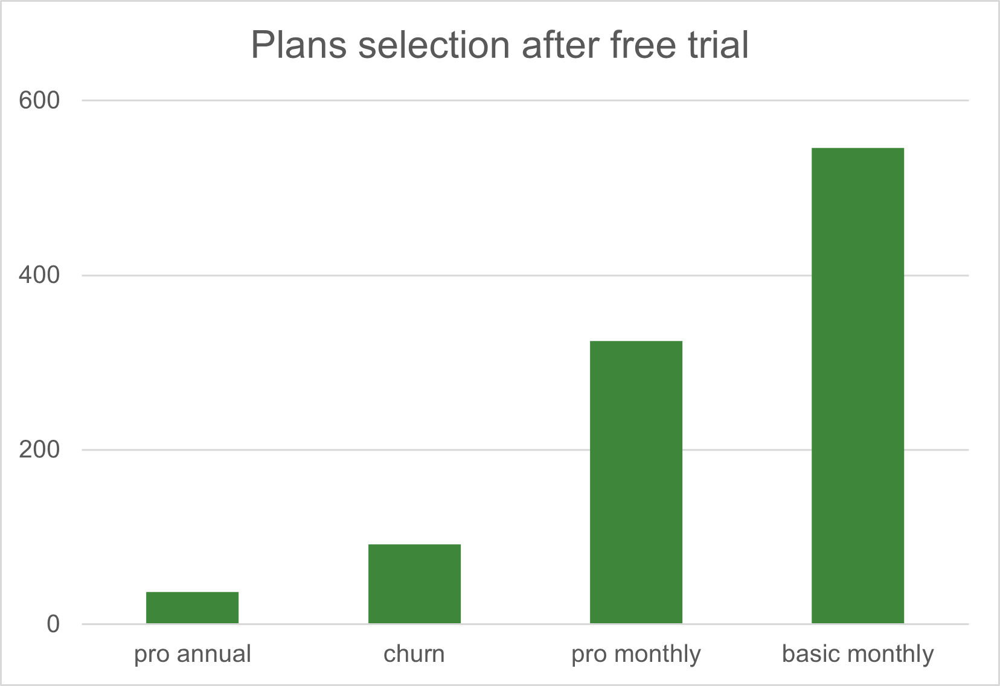
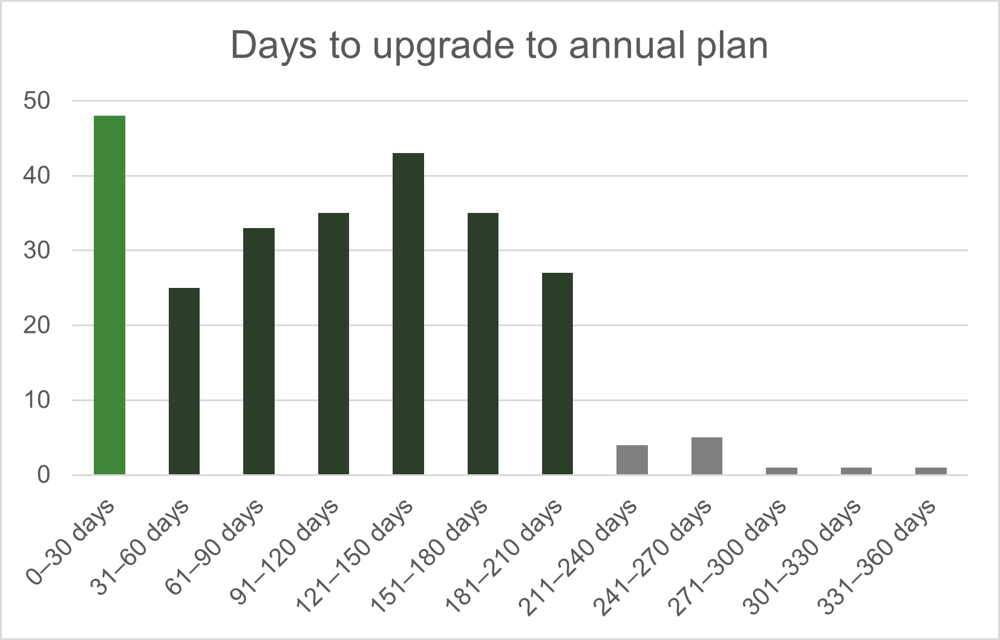

# Case Study 3: Foodie-Fi SQL Challenge Solutions

This repository contains the setup, solutions, and business insights for **Case Study 3: Foodie-Fi** of the Danny Ma **#8WeekSQLChallenge**.

---

## 🎯 Project Goal
Foodie-Fi was launched in 2020 to capitalize on the growing popularity of subscription-based businesses by offering a niche streaming platform focused exclusively on food-related content. The platform operates on monthly and annual subscriptions, giving customers unlimited on-demand access to curated cooking content from around the world. This project uses Foodie-Fi’s subscription data to answer key business questions and demonstrate how data can be used to guide product and investment decisions.

---

## 🛠️ Repository Contents

| File / Folder | Purpose |
|---------------|----------|
| **setup.sql** | Creates schemas, tables, and inserts the raw data for the challenge |
| **solutions.sql** | Contains the SQL queries for all challenge questions (plus bonus challenge) and the raw data output as comments below each query. Additional documentation for specific answers are also included under each question. |
| **insights.md (Current File)** | Contains the detailed business analysis and summarized findings derived from the SQL results. |

---

## 📈 Analytical Insights Summary

### Customer Base and Monthly Acquisition
Foodie‑Fi has accumulated 1000 customers all time. This represents the entire customer base with no sampling bias.

New customer signups volume were fairly stable month‑to‑month in 2020, indicating that Foodie‑Fi’s acquisition is not seasonally driven, but rather supported by steady marketing. Most months fall between 79–89 signups. with March being the highest at 94 and February the lowest at 68. This consistency suggests that customer acquisition remained predictable throughout the year without any major spikes or drops.

### Post-2020 Plan Movements and Churn Patterns
After 2020, there are 202 new plan events: most of which are upgrades to paid plans (60 pro monthly, 63 pro annual), while 71 result in churn. This indicates that post‑2020 activity is a mix of ongoing upgrades and customers exiting the platform. However, this metric alone doesn’t distinguish trial‑only churn from churn after paid usage, and therefore cannot be interpreted as retention behavior on its own. 

Across the entire timeframe, 307 customers have churned, equating to 30.7% of all customers. Of these, 92 customers (around 9%) decided not to opt into a premium plan after their initial free trial. Overall, this implies that the majority of churn (roughly 70%) occurs after customers have spent time on paid plans, suggesting potential retention challenges beyond the initial onboarding phase.
	
### Plan Preferences, Upgrade Behaviors and Annual Plan Conversion

After their initial free trial, 54.6% of customers selected the basic monthly plan, making it the most common plan post-trial. This was followed by the pro monthly plan at 32.5%, while 3.7% of customers upgraded directly to the pro annual plan.

By the end of 2020, the most common active subscription was the pro monthly plan (32.6%), followed by basic monthly (22.4%) and pro annual (19.5%). This suggests that the pro monthly plan is perceived as the best-value option by Foodie-Fi’s customer base. While most customers initially chose the basic monthly plan, the distribution across plans became significantly more balanced by year-end. Most of Foodie‑Fi’s customers chose the low‑commitment option initially, but will tend to upgrade over time, indicating that Foodie‑Fi is doing a good job of conveying and delivering perceived value through its product.

There were a total of 236 (23.6%) of customers by the end of 2020 who decided to cancel their subscription or stop using Foodie‑Fi after their trial. There were also 195 customers that upgraded to the annual plan in 2020, making up nearly 20% of the entire customer base and signaling that long‑term value is perceived by users. 

On average it took 105 days for a customer to upgrade to an annual plan from the day they join Foodie‑Fi. Breaking down this statistic even further: around 19% of customers took within 1 month to make that decision, and 95% of customers took within 6 months to upgrade into an annual plan. This provides Foodie‑Fi with a clear upsell window for its existing customers.

