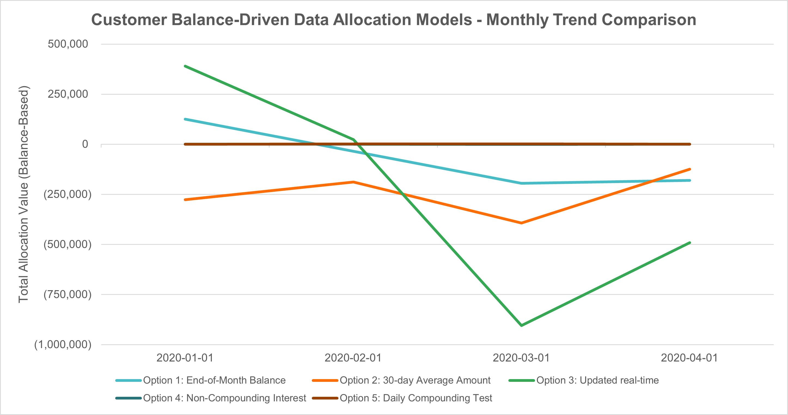

# Case Study 4: Data Bank SQL Challenge Solutions

This repository contains the setup, solutions, and business insights for **Case Study 4: Data Bank** of the Danny Ma **#8WeekSQLChallenge**.

---

## Project Goal

Data Bank is a digital‑only neo‑bank that combines traditional financial services with a distributed cloud storage platform, and each customer’s data allocation is directly tied to their account balance. This project evaluates several allocation strategies, including end‑of‑month balances, real‑time tracking, and interest‑based growth, in order to quantify how each method affects monthly data storage requirements. For this week’s challenge, all insights are based specifically on Sections C and D because these sections provide the strongest analytical foundation through their balance modeling, daily simulations, and comparative strategy outputs.

---

## Repository Contents

| File / Folder | Purpose |
|---------------|----------|
| **setup.sql** | Creates schemas, tables, and inserts the raw data for the challenge |
| **solutions.sql** | Contains the SQL queries for all challenge questions (plus bonus challenge) and the raw data output as comments below each query. Additional documentation for specific answers are also included under each question. |
| **insights.md (Current File)** | Contains the detailed business analysis and summarized findings derived from the SQL results.|

---

## Analytical Insights Summary – Data Allocation Strategy

Data Bank evaluates several balance‑driven allocation strategies to understand how different financial behaviors translate into monthly data‑storage requirements. Because each customer’s data allowance is directly tied to their account balance, these strategies provide a structured way to quantify how different patterns of deposits, withdrawals, and daily activity influence overall technical needs. Each method reflects a distinct operational logic, ranging from stable month‑end snapshots to highly dynamic real‑time and interest‑based models, allowing the business to compare volatility, predictability, and storage demand.

---

### Option 1: Allocation Based on End‑of‑Month Closing Balance
**Description:** Allocates data using each customer’s closing balance at the end of the previous month.

**Metrics Used:**
- Daily balance for each customer  
- Monthly sum of all customers’ closing balances  

**Results and Insights:**  
Monthly totals fluctuate between 126,091 and –194,916, reflecting the natural volatility of customer spending and deposits. This method is simple and stable to compute, but it can miss meaningful intra‑month activity and may under‑ or over‑allocate data depending on end‑of‑month timing.

--

### Option 2: 30‑Day Average Balance
**Description:** Allocates data based on the average balance each customer maintained over the previous 30 days.

**Metrics Used:**
- Daily balance for each customer  
- 30‑day rolling average per customer  
- Monthly sum of all customer averages  

**Results and Insights:**  
Monthly totals remain consistently negative, ranging from –124,173 to –393,005, indicating that customers generally spend more than they deposit over sustained periods. This approach smooths out short‑term spikes and provides a more stable estimate, but it also reveals that long‑term balance behavior is essentially negative.

--

### Option 3: Updated Real‑Time Balance
**Description:** Allocates data using every running balance value recorded throughout the month.

**Metrics Used:**
- Full running balance for each customer (time series)  
- Monthly sum of all running balance values  

**Results and Insights:**  
This option shows extreme volatility, from a high of 390,315 in January to a low of –904,668 in March. Because it captures every intra‑day fluctuation, it produces the most sensitive and operationally unpredictable allocation requirement.

--

### Option 4: Non‑Compounding Daily Interest
**Description:** Allocates data based on daily interest earned using a fixed daily rate without compounding.

**Metrics Used:**
- Daily balance  
- Daily interest = balance × (0.06 / 365)  
- Monthly sum of daily interest  

**Results and Insights:**  
Monthly totals fall between –538 and 480, which is expected given the small daily rate and the mix of positive and negative balances. This method produces modest, stable values and offers a predictable way to reward customers without introducing compounding effects.

--

### Option 5: Compounding Daily Interest
**Description:** Allocates data based on interest that compounds daily, causing each day’s interest to increase the next day’s balance.

**Metrics Used:**
- Daily compounded balance  
- Daily interest = compounded balance × (0.06 / 365)  
- Monthly sum of daily interest  

**Results and Insights:**  
Monthly totals range from 578 to 1,994, consistently higher than the non‑compounding version due to the cumulative effect of compounding. This method amplifies both positive and negative balance behavior and results in the highest data‑allocation requirements among all strategies.

--- 
## Final Recommendation
A balanced recommendation is to use Option 2 (30‑day average balance) as the primary allocation strategy because it smooths out short‑term volatility while still reflecting meaningful customer behavior, which makes monthly provisioning far more predictable. Option 4 (non‑compounding interest) can be layered on top as a small, controlled incentive mechanism since it produces stable, low‑magnitude adjustments without introducing operational risk. Option 3 (real‑time) should not be used for provisioning because its volatility creates unpredictable spikes that would force Data Bank to over‑allocate storage.
